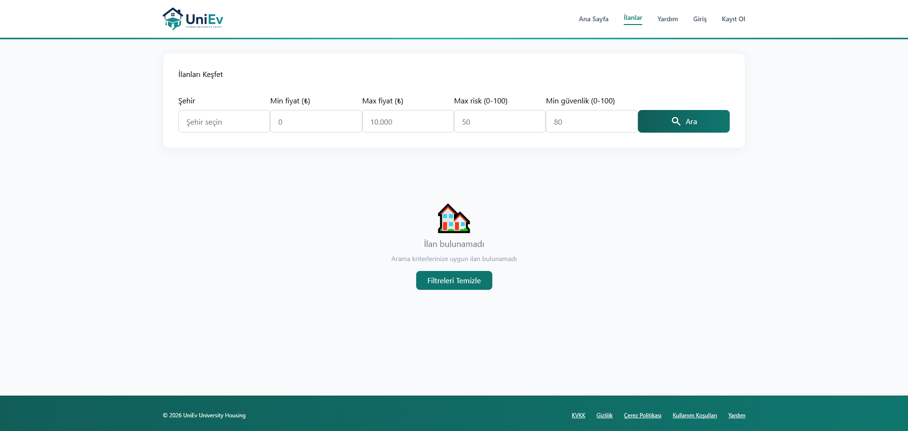
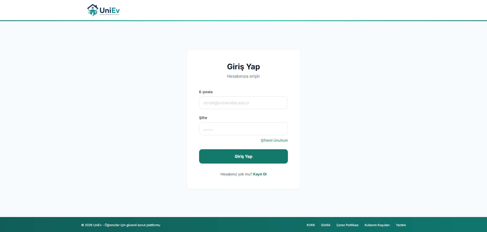
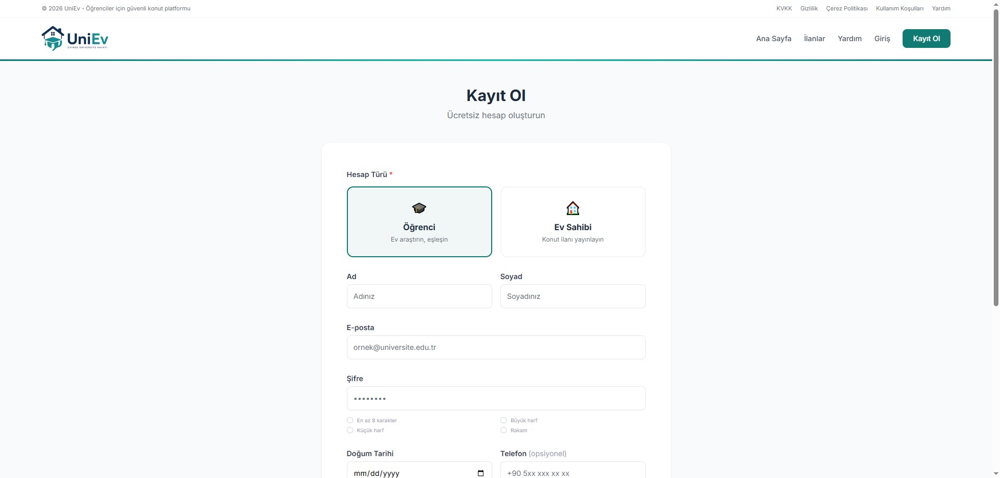
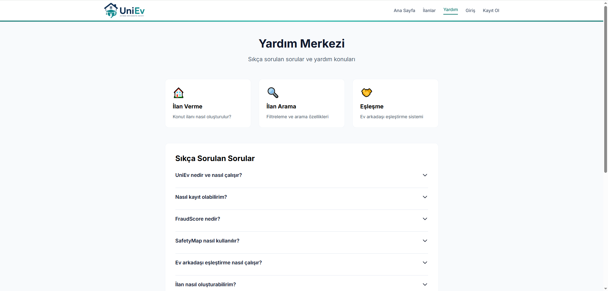

# 🎓 UniEv — Student Housing & Roommate Platform


> A modern student housing & roommate matching platform designed to simplify university life by helping students find accommodation, roommates, and communicate safely in one integrated system.

---

## 🌟 About The Project

UniEv is a full-stack university housing platform developed to help students find safe housing and suitable roommates through a modern and user-friendly system.

The platform provides:

* Trusted rental listings
* Smart roommate matching
* Real-time messaging system
* Favorites & profile management
* Fraud detection tools
* Interactive safety features
* Responsive user interface
* Powerful admin dashboard

---

## 🚀 Main Features

* 🔐 Authentication & Authorization
* 🏠 Property Listings System
* ❤️ Favorites System
* 💬 Real-Time Messaging (Socket.IO)
* 🤝 Smart Roommate Match Engine
* 🛡️ Fraud Detection & Safety Map
* 👤 Profile Management
* 📸 Image Upload Support
* 📊 Advanced Admin Dashboard
* 📧 Email Verification System
* 🔔 Notifications System
* 📱 Responsive UI
* ⚡ FastAPI Backend Performance
* 🌍 Multi-User Platform

---

## 🛠️ Technologies Used

| Category               | Technologies            |
| ---------------------- | ----------------------- |
| Backend Framework      | FastAPI                 |
| Programming Language   | Python 3.12+            |
| Database               | SQLite / PostgreSQL     |
| ORM                    | SQLAlchemy              |
| Authentication         | JWT Authentication      |
| Realtime Communication | Socket.IO               |
| Frontend               | HTML5, CSS3, JavaScript |
| Server                 | Uvicorn                 |
| Version Control        | Git & GitHub            |
| Development Tools      | VS Code                 |

---

## 🌐 Live Demo

[](https://uniev.onrender.com)

---

## 📂 Project Structure

```text id="ywj8i5"
📁 core
📁 templates
📁 static
📁 uploads
📁 screenshots
│
├── 🖼️ dashboard.png
├── 🖼️ ilan.png
├── 🖼️ login.png
├── 🖼️ signin.png
└── 🖼️ yardim.png

📄 database.py
📄 main.py
📄 create_admin.py
📄 create_test_data.py
📄 requirements.txt
📄 .env.example
📄 HOW_TO_RUN.md
📄 README.md
```

---

## 🔐 Demo Accounts

| Role    | Email                                         | Password |
| ------- | --------------------------------------------- | -------- |
| Admin   | [admin@uniev.com](mailto:admin@uniev.com)     | admin123 |
| Student | [student@uniev.com](mailto:student@uniev.com) | 123456   |

---

## 🎯 Platform Modules

### 🏠 Property Listings

* Create and manage rental listings
* Upload property images
* View detailed property information

### 🤝 Roommate Matching

* Match students based on preferences
* Compatibility-focused recommendations
* Safe communication system

### 💬 Messaging System

* Real-time private messaging
* Instant communication using Socket.IO
* Notification support

### 📊 Admin Dashboard

* User monitoring
* Listing moderation
* Report management
* Platform analytics

---

## 📸 Screenshots


---



---



---



---



---

## 🔒 Security Features

* Password Hashing
* JWT Authentication
* Fraud Score Detection
* Login Protection
* Role-Based Access Control
* Email Verification
* Secure Session Management

---

## 📈 Future Improvements

* 📱 Mobile Application
* 🤖 AI Roommate Recommendation
* 💳 Payment Integration
* 🗺️ Google Maps Integration
* 🌍 Multi-Language Support
* ☁️ Cloud Deployment Optimization

---

## 📄 License

This project was developed for academic and educational purposes.

---

## 👥 Team

### ŞARJÖR Team

* Kusai Aksoy
* Hashem Salem
* Namiq
* Rama Hasanatu
* Melih

---

## 🎥 Project Demo Video

[](https://youtu.be/BJKZr4FfNJQ)

---

Or directly open the video here:

https://youtu.be/BJKZr4FfNJQ


# ⭐ Support

If you like this project, consider giving it a star on GitHub.
