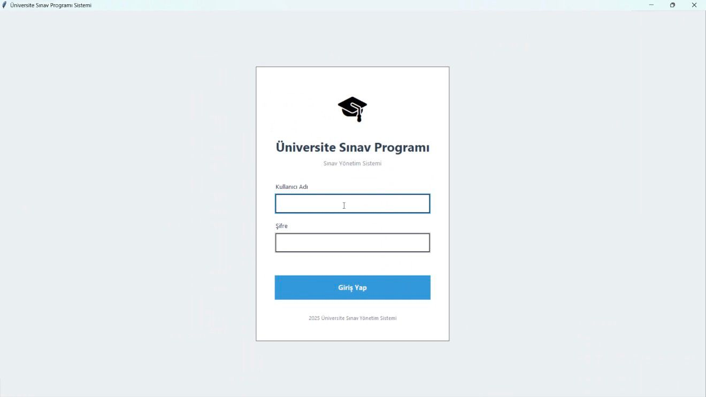
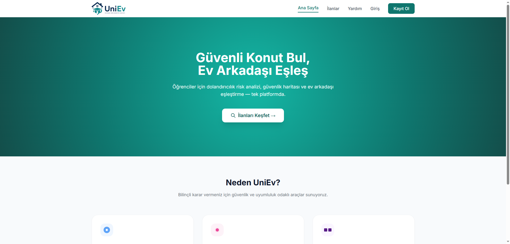

# UniEv 🎓

### Evinde Üniversite Hayatı


> A modern student housing & roommate matching platform designed to simplify university life by helping students find accommodation, roommates, and communicate safely in one integrated system.

---

## 📌 About The Project

UniEv is a full-stack university housing platform developed to help students:

- Find trusted rental listings
- Match with compatible roommates
- Chat in real-time
- Manage favorites and profiles
- Access safety and fraud prevention tools

The platform also includes an advanced admin panel for monitoring users, reports, listings, and platform activity.

---

## 🚀 Main Features

- 🔐 Authentication & Authorization
- 🏠 Property Listings System
- ❤️ Favorites System
- 💬 Real-Time Messaging (Socket.IO)
- 🤝 Roommate Match Engine
- 🛡️ Fraud Detection & Safety Map
- 👤 Profile Management
- 📸 Image Upload Support
- 📊 Admin Dashboard
- 📧 Email Verification System
- 🔔 Notifications System
- 📱 Responsive UI

---

## 🛠️ Technologies Used

### Backend
- Python 3.12+
- FastAPI
- SQLAlchemy
- SQLite / PostgreSQL
- Socket.IO
- JWT Authentication

### Frontend
- HTML5
- CSS3
- JavaScript

### Tools
- Uvicorn
- Git & GitHub
- VS Code

---

## 📂 Project Structure

```text
UniEv/
│
├── core/
├── templates/
├── static/
├── uploads/
├── database.py
├── main.py
├── create_admin.py
├── create_test_data.py
├── requirements.txt
├── .env.example
└── HOW_TO_RUN.md
```

---


---

## 📸 Screenshots

Add your screenshots here.

```md



```

---

## 📖 Full Setup Guide

See `HOW_TO_RUN.md` for the complete installation guide.

---

## 🌐 Live Demo

[](https://uniev.onrender.com)

---

## 🔒 Security Features

- Password Hashing
- JWT Authentication
- Fraud Score Detection
- Login Protection
- Role-Based Access Control
- Email Verification

---

## 📈 Future Improvements

- Mobile Application
- AI Roommate Recommendation
- Payment Integration
- Google Maps Integration
- Multi-Language Support

---

## 📄 License

This project was developed for academic and educational purposes.

---

## 👥 Team

### ŞARJÖR Team

- Kusai Aksoy
- Hashem Salem
- Namiq
- Rama Hasanatu
- Melih

---

# ⭐ Support

If you like this project, consider giving it a star on GitHub.
